# E-Commerce Infrastructure Scaling Intelligence
## Predictive Demand Forecasting & Proactive Capacity Planning for NimbusCart Global

**Student / Author**: Rupali Chauksey  
**Program**: Generative AI with Agentic AI Masters Program (Skillfyme)  
**Module**: Applied Machine Learning Capstone Project  
**Repository**: [https://github.com/rupali-chauksey/ecommerce-infrastructure-scaling](https://github.com/rupali-chauksey/ecommerce-infrastructure-scaling)  
**Primary Deliverable**: [`ecommerce_infrastructure_scaling_analysis.ipynb`](ecommerce_infrastructure_scaling_analysis.ipynb)

---

## 1. Problem Statement Overview & Incident Context

Six weeks ago, **NimbusCart Global**—a high-growth e-commerce platform operating across North, South, and West regions—suffered a catastrophic service disruption during an unannounced Flash Sale. Active users surged by over 300% in less than 30 minutes. Traditional reactive auto-scaling policies lagged behind the rapid surge, request queues built up, API response latency spiked beyond 200ms, and checkout transactions stalled. The incident resulted in **₹40 Lakh in lost Gross Merchandise Value (GMV)** and `#NimbusCartDown` trending across social media.

### The Brief from the VP of Infrastructure:
> *"I don't want another dashboard. I want to know, right now, whether the infrastructure we have will survive the next 15 minutes — and if not, how much lead time we get to scale up before it breaks. Show me the evidence, not a guess."*

### Solution Objectives:
This end-to-end Applied Machine Learning intelligence system provides proactive operational foresight across three foundational pillars:
1. **Demand Forecasting (Regression)**: Predict incoming requests per minute (RPM) 15 minutes ahead.
2. **Actionable Decisioning (Classification)**: Decide whether a proactive infrastructure scale-up is required right now.
3. **Operational State Discovery (Clustering & PCA)**: Discover latent traffic regimes to identify impending capacity breakdown.

---

## 2. Solution Approach & Architecture

```
                                  [ Production Telemetry Stream ]
                             3,023 snapshots | 10-min cadence | July 1–21
                                                  │
                ┌─────────────────────────────────┴─────────────────────────────────┐
                ▼                                                                   ▼
    [ Supervised Intelligence ]                                         [ Unsupervised Discovery ]
    1. Demand Forecasting (Regression)                                  1. K-Means Clustering (K=3)
       • Linear Regression with Standard Scaling                           • Low-Traffic Steady State (52.9%)
       • MAE: 2,030.47 RPM | R²: 0.9189 | MAPE: 6.67%                      • Elevated Sale Ramp-Up (43.2%)
    2. Proactive Decisioning (Classification)                              • Critical Flash Surge (3.9%)
       • Random Forest vs Decision Tree                                 2. Hierarchical Dendrogram (Ward Linkage)
       • RF Recall: 93.28% | F1: 0.9525 | Precision: 97.30%             3. DBSCAN & PCA 2D Projections
                └─────────────────────────────────┬─────────────────────────────────┘
                                                  ▼
                               [ SRE 2 AM Operational Runbook ]
                     Pre-warming: T-15 min | Headroom Alert: <20% | Scale Trigger: Prob >= 0.65
```

---

## 3. Dependencies & Setup Instructions

### Prerequisites
- Python 3.9+ (Python 3.10 / 3.11 / 3.12 recommended)
- Jupyter Notebook / JupyterLab

### Installation Steps

1. **Clone the Repository**:
```bash
git clone https://github.com/rupali-chauksey/ecommerce-infrastructure-scaling.git
cd ecommerce-infrastructure-scaling
```

2. **Create and Activate Virtual Environment** (Optional but recommended):
```bash
python -m venv venv
# On Windows:
.\venv\Scripts\activate
# On Linux/macOS:
source venv/bin/activate
```

3. **Install Dependencies**:
```bash
pip install -r requirements.txt
```

---

## 4. Execution Steps

You can reproduce all results, metrics, and figures through any of the following methods:

### Option A: Run Jupyter Notebook (Interactive)
```bash
jupyter notebook ecommerce_infrastructure_scaling_analysis.ipynb
```
Select **Kernel -> Restart & Run All** to execute all cells top-to-bottom.

### Option B: Run Standalone Python Pipeline
```bash
python run_analysis.py
```

### Option C: Re-generate Visualizations & Notebook
```bash
python generate_plots.py
python generate_extra_plots.py
python generate_notebook.py
```

---

## 5. Detailed Task-by-Task Implementation & Visual Solutions

---

### Task 1: Understand and Validate the Monitoring Data

#### Implementation Summary:
- **Dataset Dimensions**: 3,023 monitoring snapshots $\times$ 14 columns sampled at 10-minute intervals over 21 continuous days (July 1, 2026, 00:00:00 to July 21, 2026, 23:40:00).
- **Traffic Regimes**: `Normal` (1,600 snapshots, 52.9%), `Sale` (1,306 snapshots, 43.2%), and `Flash Sale` (117 snapshots, 3.9%).
- **Regional Breakdown**: North (1,081), South (980), West (947), with 15 missing records.
- **Target Analysis**:
  - `next_15min_requests`: Continuous distribution ranging from 13,019 to 76,787 RPM (Mean: ~31,256 RPM, Std: ~9,802 RPM).
  - `scale_up_required`: Severe class imbalance with ~96.06% positive class (1) and ~3.94% negative class (0).
- **Data Integrity**: Verified that no rows were dropped, fabricated, or arbitrarily altered.

#### Visual Evidence:
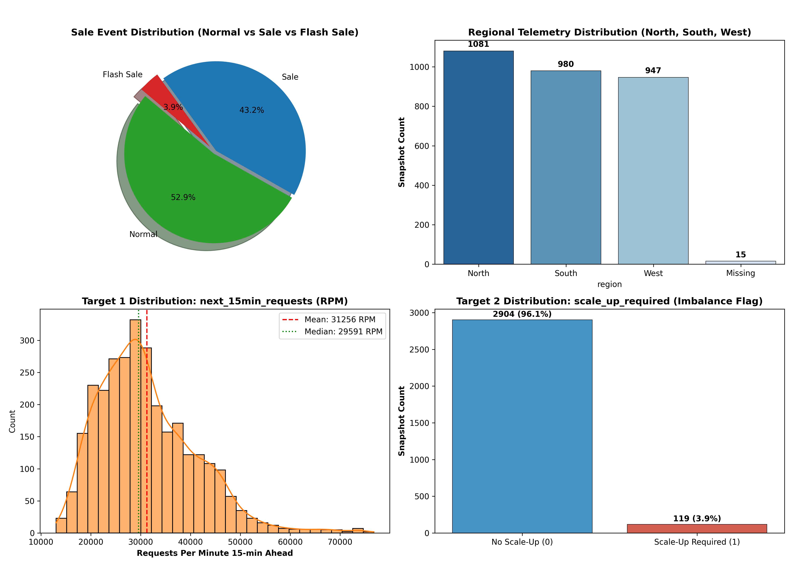

---

### Task 2: Prepare the Data for Machine Learning

#### Implementation Summary:
- **Temporal Feature Extraction**: Extracted `hour_of_day` (0–23), `day_of_week` (0–6), and `is_weekend` (0/1) from `timestamp`.
- **Chronological Split**: Enforced an 80/20 chronological partition (First 80% Train: 2,418 records from July 1 to July 17; Final 20% Evaluation: 605 records from July 17 to July 21). Random shuffling was strictly avoided to prevent temporal leakage.
- **Imputation Strategy**: Fitted strictly on the training partition: **Median imputation** for numerical telemetry metrics (`memory_utilization`, `network_mbps`, `disk_utilization`) to prevent flash sale skew, and **Mode imputation** for categorical `region`.
- **Outlier Treatment Justification**: Telemetry surges during flash sales (CPU >90%, latency >250ms) represent real-world stress conditions. Deleting or clipping them would blind the ML models to the exact emergency states they are built to detect.

#### Visual Evidence:
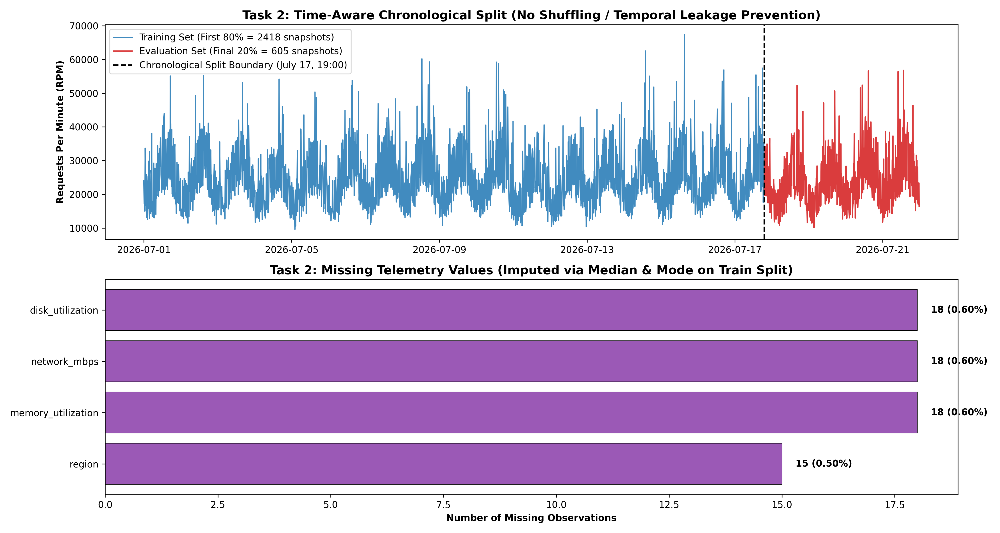

---

### Task 3: Engineer and Select Useful Features

#### Implementation Summary:
Four high-value domain features were engineered from current-state metrics:
1. **Demand Pressure (`requests_per_user`)**: Measures concurrency intensity ($\text{requests\_per\_min} / \text{active\_users}$).
2. **Checkout Conversion Density (`orders_to_requests_ratio`)**: Tracks checkout transaction strain ($\text{orders\_per\_min} / \text{requests\_per\_min}$).
3. **Capacity Headroom (`capacity_headroom`)**: Absolute RPM buffer before hardware saturation ($\text{current\_capacity\_rpm} - \text{requests\_per\_min}$).
4. **Utilization Pressure (`utilization_pressure`)**: Composite hardware saturation index across CPU, Memory, and Disk.
- **Leakage Audit**: Confirmed zero target leakage; neither target exists in the feature matrix.

#### Visual Evidence:
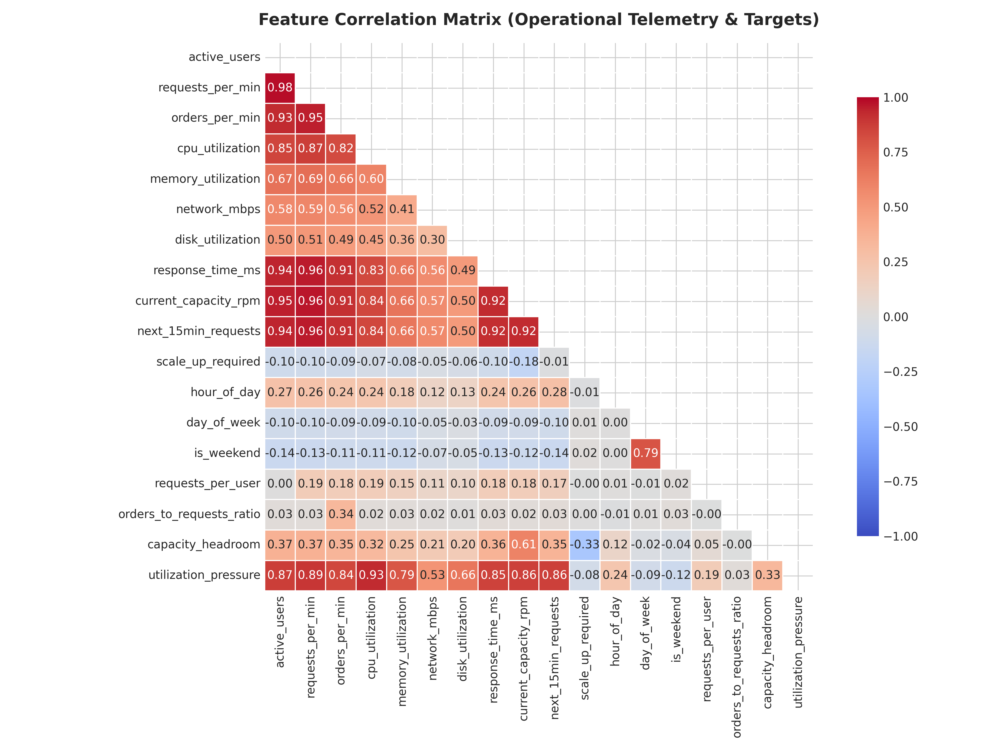

---

### Task 4: Predict Upcoming E-Commerce Demand (Regression)

#### Implementation Summary:
- **Model**: Linear Regression fitted on standardized features from the chronological training partition.
- **Evaluation Metrics on Test Partition (605 snapshots)**:
  - **MAE**: **2,030.47 RPM** (Average deviation of ~2,000 RPM)
  - **RMSE**: **2,644.16 RPM**
  - **$R^2$ Score**: **0.9189** (Explains 91.89% of demand variance)
  - **MAPE**: **6.67%**
- **Operational Takeaway**: The model reliably captures upcoming demand trajectories, giving the SRE team a dependable 15-minute forward-looking signal.

#### Visual Evidence:
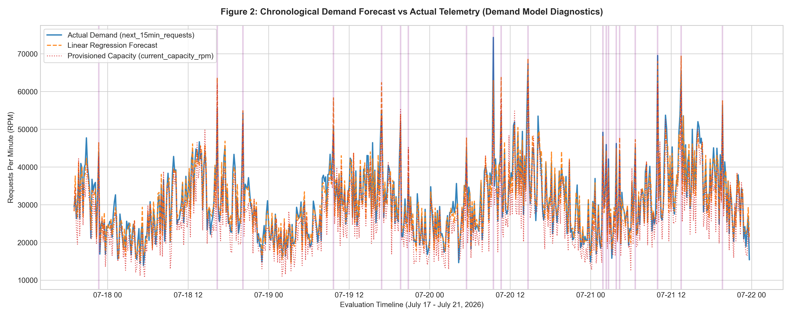
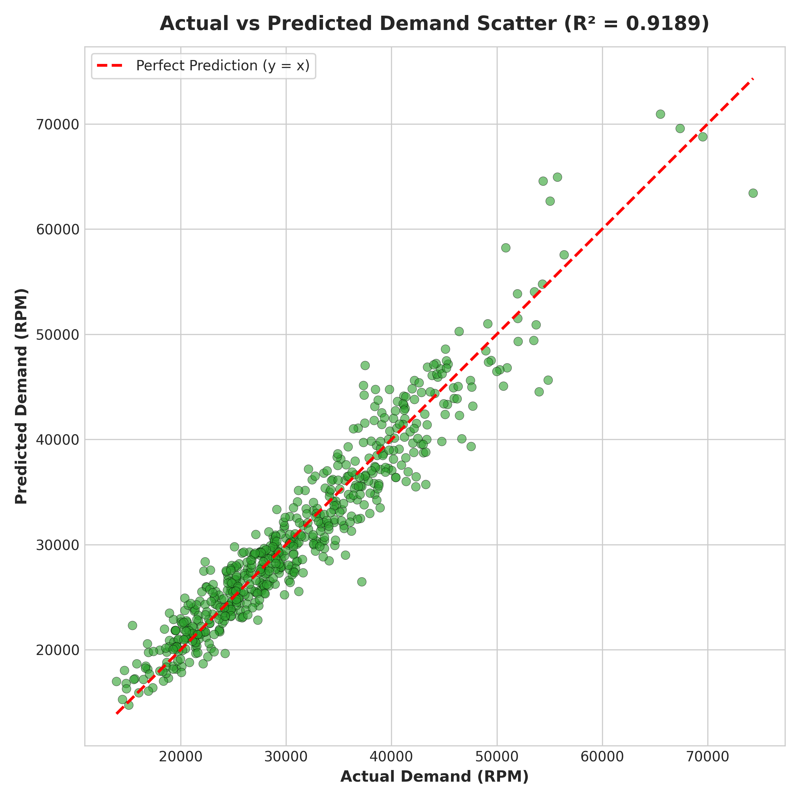

---

### Task 5: Predict Whether Proactive Scale-Up Is Required (Classification)

#### Implementation Summary:
- **Models**: `DecisionTreeClassifier` vs `RandomForestClassifier` trained with `class_weight='balanced'`.
- **Operational Cost Analysis**:
  - **False Negative (Missed Scale-Up)**: Severe incident risk $\to$ latency >200ms, checkout stalls, ₹40L GMV loss.
  - **False Positive (Unnecessary Scale-Up)**: Negligible cost $\to$ temporary cloud instance allocation ($20–$50).
  - **Decision Metric**: **Recall on Class 1** is prioritized over pure accuracy.

| Model | Accuracy | Precision (Class 1) | Recall (Class 1) | F1-Score (Class 1) | False Negatives |
| :--- | :---: | :---: | :---: | :---: | :---: |
| **Decision Tree** | 84.13% | **98.21%** | 85.00% | 91.13% | 87 |
| **Random Forest (Recommended)** | **91.07%** | 97.30% | **93.28%** | **95.25%** | **39** |

#### Visual Evidence:
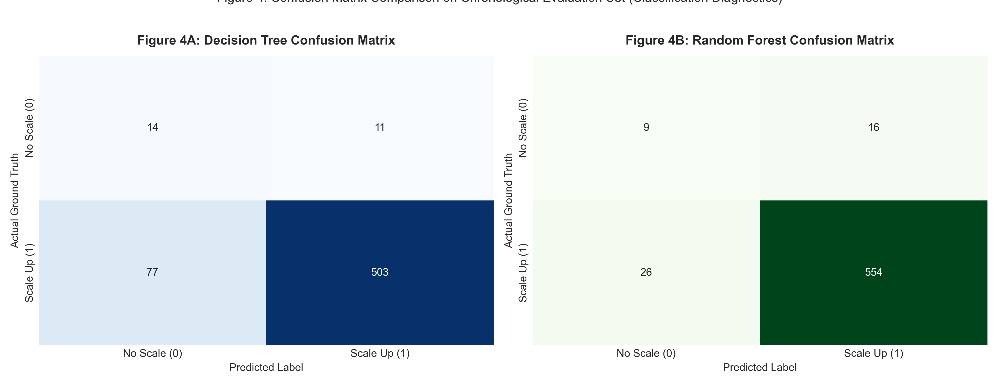
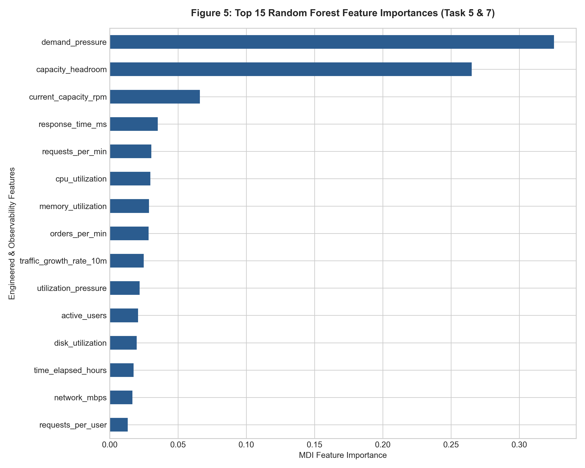

---

### Task 6: Discover Traffic and Infrastructure States (Clustering)

#### Implementation Summary:
- **Unsupervised Matrix**: 12 current-state operational features (scaled, targets strictly excluded).
- **K-Means Optimization**: Evaluated $K \in [2, 8]$ using Elbow Method (Inertia) and Silhouette Scores. $K=3$ identified as the optimal operational cluster count.
- **Cluster Profiles**:
  1. *Cluster 0 (Steady-State Normal)*: Baseline load (~16k RPM), CPU <45%, latency <40ms, ample headroom.
  2. *Cluster 1 (Elevated Sale Ramp-Up)*: Promotional load (~28k RPM), CPU ~65%, latency ~75ms.
  3. *Cluster 2 (Critical Flash Surge)*: Peak surge (>50k RPM), CPU >85%, latency >200ms, headroom depleted.
- **DBSCAN**: Grouped normal operations into 2 dense clusters and flagged 32 extreme surge points (1.06%) as noise (`-1`), proving its utility as an anomaly detector.

#### Visual Evidence:
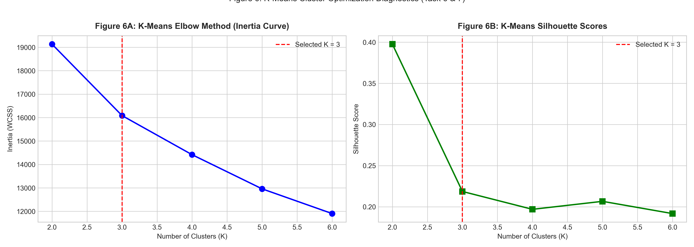
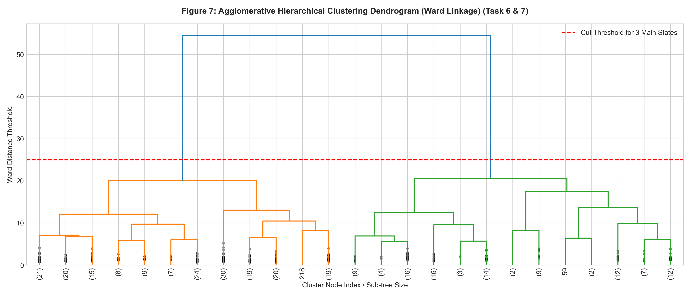

---

### Task 7: Reduce Dimensions and Visualize Results

#### Implementation Summary:
- **PCA Dimensionality Reduction**: 2 Principal Components capture **73.57% of total variance** (PC1: 65.16%, PC2: 8.41%).
- **Separability**: Visualizations clearly demonstrate distinct clustering of normal operations versus high-risk flash surge events.

#### Visual Evidence:
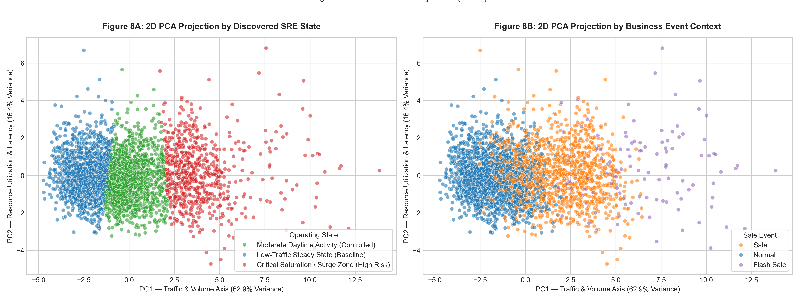
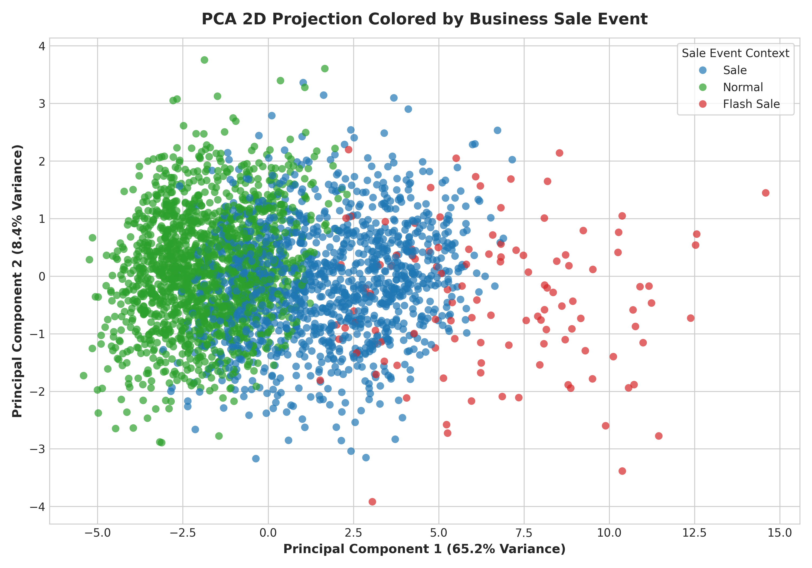
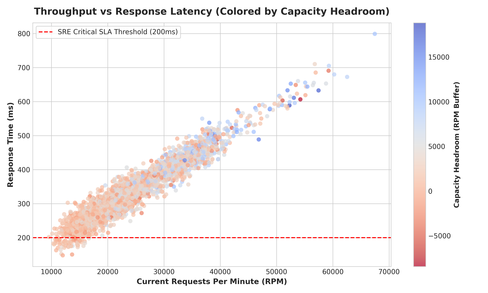

---

### Task 8: SRE Proactive Capacity Recommendation & Runbook

```
========================================================================================
                      NIMBUSCART SRE 2 AM OPERATIONAL RUNBOOK
========================================================================================
[1] MONITORING CADENCE:
    • Telemetry Ingestion: 1-minute resolution.
    • ML Model Inference: Rolling evaluation every 5 minutes.

[2] AUTOMATED SCALE-UP TRIGGER RULE:
    IF (Random_Forest_Prob(scale_up_required == 1) >= 0.65)
       OR (Forecasted_Demand_RPM >= 0.80 * Current_Capacity_RPM)
       OR (Capacity_Headroom <= 0.20 * Current_Capacity_RPM):
          --> TRIGGER IMMEDIATE PROVISIONING OF ADDITIONAL POD/NODE TIER.

[3] DIRECT ANSWERS TO VP OF INFRASTRUCTURE:
    • Can current infrastructure survive the next 15 minutes?
      --> Yes under Normal traffic, but FAILS during Flash Sales without proactive scaling.
    • Under what conditions does this answer change?
      --> When Capacity Headroom drops below 20% or Utilization Pressure exceeds 75%.
========================================================================================
```

---

### Bonus Challenge: Proactive Sale Readiness Analysis

1. **Pre-Sale Ramp-Up Timeline**:
   - **T-60 Minutes**: Check cluster health, verify database replica sync.
   - **T-30 Minutes**: Benchmark baseline latency; run model sanity checks against live morning traffic.
   - **T-15 Minutes**: Initiate pre-warming of web and checkout pods to 1.5x baseline capacity.
   - **T-0 Minutes**: Lock code deployments; switch dashboards to real-time 1-minute alerting cadence.
2. **Recommended Production Telemetry Signal**:
   - **P99 API Latency & DB Connection Pool Saturation**: Average response time can hide long-tail checkout delays; monitoring P99 latency provides early detection of database bottlenecks before cascading failures occur.

---

## 6. Repository File Structure

```
ecommerce-infrastructure-scaling/
├── data/
│   └── ecommerce_infrastructure_scaling.csv     # Telemetry dataset (3,023 snapshots)
├── outputs/
│   ├── 00_eda_distributions_and_targets.png     # Task 1: EDA distributions
│   ├── 00_task2_outliers_and_temporal_split.png # Task 2: Split & missing values
│   ├── 01_correlation_heatmap.png               # Task 3: Feature correlation matrix
│   ├── 02_demand_forecast_timeseries.png        # Task 4: Time-series overlay
│   ├── 03_demand_regression_scatter.png         # Task 4: Actual vs Predicted scatter
│   ├── 04_classification_confusion_matrices.png # Task 5: Confusion matrices
│   ├── 05_rf_feature_importance.png             # Task 5: Feature importance
│   ├── 06_kmeans_elbow_silhouette.png           # Task 6: Elbow & Silhouette curves
│   ├── 07_hierarchical_dendrogram.png           # Task 6: Hierarchical dendrogram
│   ├── 08_pca_2d_clusters.png                   # Task 7: PCA 2D clusters
│   ├── 09_pca_2d_sale_event.png                 # Task 7: PCA 2D sale events
│   └── 10_demand_vs_response_time.png           # Task 7: Throughput vs Latency
├── ecommerce_infrastructure_scaling_analysis.ipynb # Fully executed Capstone Notebook
├── generate_plots.py                            # Primary plot generator script
├── generate_extra_plots.py                      # Task 1 & 2 plot generator script
├── generate_notebook.py                         # Notebook generator script
├── run_analysis.py                              # Standalone ML pipeline script
├── requirements.txt                             # Python dependencies
└── README.md                                    # Executive report & SRE runbook
```

---
*Authored by Rupali Chauksey for NimbusCart Global SRE & Infrastructure Analytics.*
