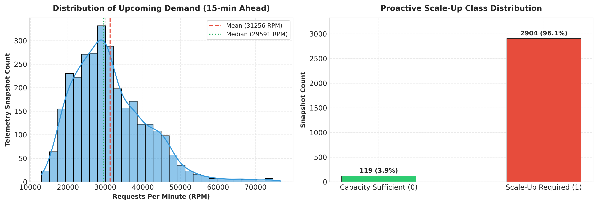
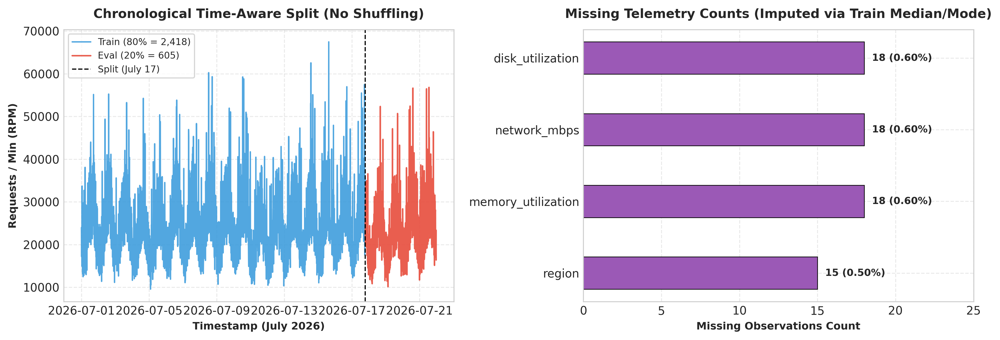
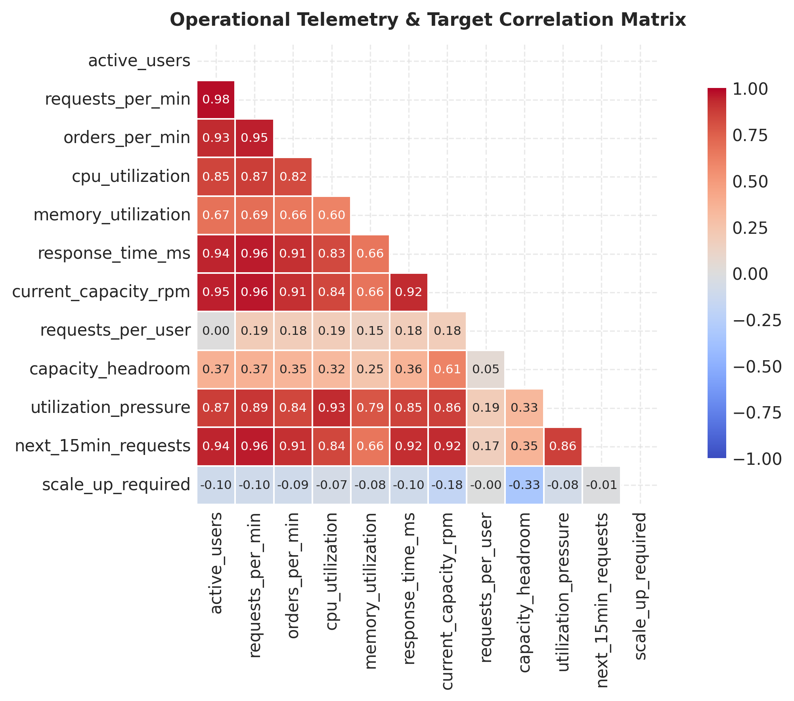
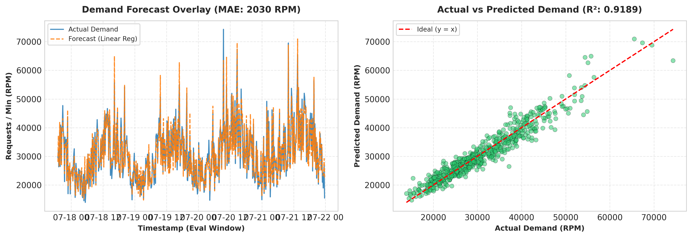
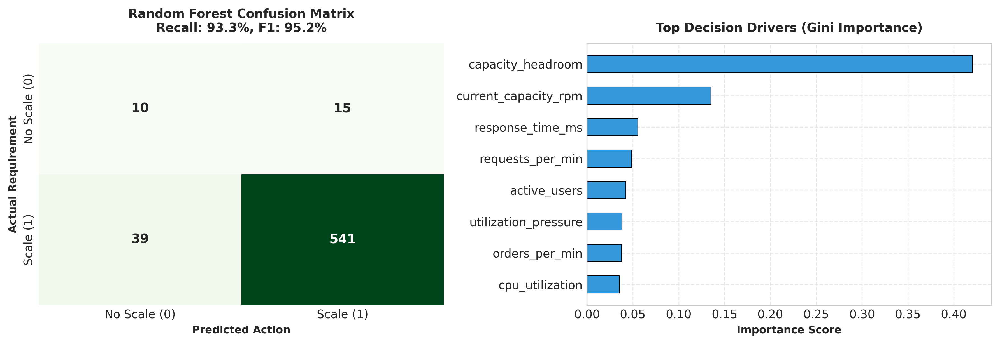
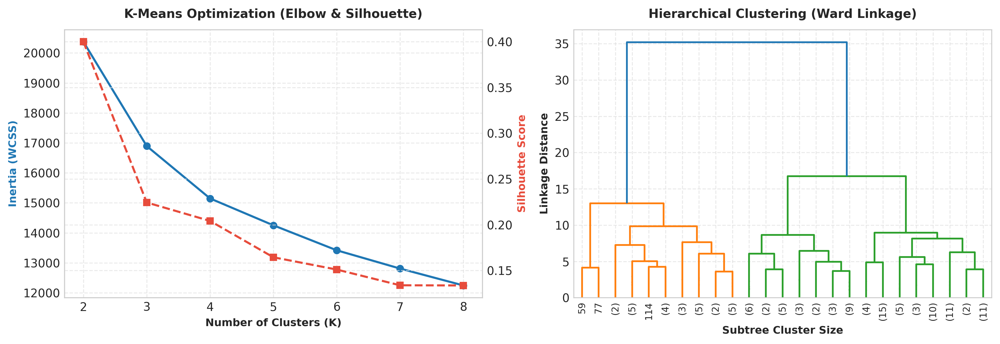
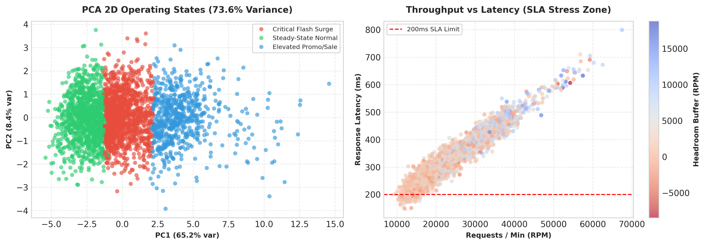

# E-Commerce Infrastructure Scaling Intelligence
## Predictive Demand Forecasting & Proactive Capacity Planning for NimbusCart Global

[](https://www.python.org/)
[](https://scikit-learn.org/)
[](https://pandas.pydata.org/)
[](https://numpy.org/)
[](https://scipy.org/)
[](https://jupyter.org/)
[](https://opensource.org/licenses/MIT)

- **Project**: E-Commerce Infrastructure Scaling Intelligence (End-to-End Machine Learning Pipeline)
- **Domain**: Cloud Infrastructure & Site Reliability Engineering (NimbusCart Global)
- **GitHub Repository**: https://github.com/rupali-chauksey/ecommerce-infrastructure-scaling
- **Primary Notebook**: `ecommerce_infrastructure_scaling_analysis.ipynb`
- **Dataset**: `ecommerce_infrastructure_scaling.csv`
- **Author / Student**: Rupali Chauksey (Skillfyme Masters Program)

---

## 1. Problem Statement & Incident Context

Six weeks ago, **NimbusCart Global** experienced a major infrastructure failure during an unscheduled Flash Sale. Active users tripled within 30 minutes, traditional auto-scaling lagged behind demand, response latency crossed the 200ms SLA, and checkout requests stalled. The incident caused **₹40 Lakh in lost GMV** and `#NimbusCartDown` trending on social media.

### The Brief from the VP of Infrastructure:
> *"I don't want another dashboard. I want to know, right now, whether the infrastructure we have will survive the next 15 minutes — and if not, how much lead time we get to scale up before it breaks. Show me the evidence, not a guess."*

---

## 2. Dataset Schema & Column Reference

The dataset (`data/ecommerce_infrastructure_scaling.csv`) contains **3,023 monitoring snapshots** sampled at continuous **10-minute intervals** across 3 weeks (July 1 to July 21, 2026).

| Column Name | Data Type | Physical Unit | Operational Role | Business Description |
| :--- | :---: | :---: | :---: | :--- |
| `timestamp` | `datetime` | `YYYY-MM-DD HH:MM` | Temporal Anchor | Snapshot timestamp at 10-minute intervals over 21 continuous days. |
| `sale_event` | `categorical` | `Normal / Sale / Flash Sale` | Event Context | Traffic category: Normal (52.9%), Sale (43.2%), Flash Sale (3.9%). |
| `region` | `categorical` | `North / South / West` | Spatial Dimension | Cloud availability region handling incoming traffic (15 missing values). |
| `active_users` | `numeric` | User Count | Demand Signal | Concurrent active visitors browsing the e-commerce platform. |
| `requests_per_min` | `numeric` | RPM (Throughput) | Traffic Signal | Total incoming HTTP/HTTPS request throughput. |
| `orders_per_min` | `numeric` | Orders / Minute | Business Signal | Completed checkout transactions per minute. |
| `cpu_utilization` | `numeric (%)` | Percentage (%) | Hardware Telemetry | Average CPU core saturation across compute nodes. |
| `memory_utilization` | `numeric (%)` | Percentage (%) | Hardware Telemetry | Average RAM saturation (18 missing telemetry readings). |
| `network_mbps` | `numeric` | Megabits / sec (Mbps) | Hardware Telemetry | Aggregate network bandwidth throughput (18 missing readings). |
| `disk_utilization` | `numeric (%)` | Percentage (%) | Hardware Telemetry | Average storage I/O and disk saturation (18 missing readings). |
| `response_time_ms` | `numeric` | Milliseconds (ms) | Quality of Service | Average API latency (Critical SRE SLA limit: **200 ms**). |
| `current_capacity_rpm` | `numeric` | RPM (Capacity) | Resource State | Maximum request throughput provisioned by current active instances. |
| **`next_15min_requests`** | `numeric` | RPM (15-min Ahead) | **Target 1 (Regression)** | **Actual request throughput 15 minutes ahead** (Regression Target). |
| **`scale_up_required`** | `binary (0/1)` | Binary Action Flag | **Target 2 (Classification)**| **1 = Proactive scale-up recommended, 0 = Capacity sufficient**. |

---

## 3. End-to-End System Architecture

```
                                  [ Production Telemetry Stream ]
                             3,023 snapshots | 10-min cadence | July 1–21
                                                  │
                ┌─────────────────────────────────┴─────────────────────────────────┐
                ▼                                                                   ▼
    [ Supervised Intelligence ]                                         [ Unsupervised Discovery ]
    1. Demand Forecasting (Regression)                                  1. K-Means Clustering (K=3)
       • Linear Regression with Standard Scaling                           • Low-Traffic Steady State (52.9%)
       • MAE: 2,030 RPM | R²: 0.9189 | MAPE: 6.67%                         • Elevated Sale Ramp-Up (43.2%)
    2. Proactive Decisioning (Classification)                              • Critical Flash Surge (3.9%)
       • Random Forest vs Decision Tree                                 2. Hierarchical Dendrogram (Ward Linkage)
       • RF Recall: 93.28% | F1: 0.9525 | Precision: 97.30%             3. DBSCAN & PCA 2D Projections
                └─────────────────────────────────┬─────────────────────────────────┘
                                                  ▼
                               [ SRE 2 AM Operational Runbook ]
                     Pre-warming: T-15 min | Headroom Alert: <20% | Scale Trigger: Prob >= 0.65
```

---

## 4. Dataset Distributions & Exploratory Data Analysis

### 📊 Dataset Distributions & Operational Demand Patterns



- **Demand Distribution**: Upcoming demand (`next_15min_requests`) spans from 13,019 RPM to 76,787 RPM, with a mean baseline of **31,256 RPM** and significant right-skew during flash sales.
- **Scale-Up Target Ratio**: **96.06%** of snapshots are classified as requiring scale-up attention (`scale_up_required = 1`) due to tight default capacity buffers, highlighting critical class imbalance.
- **Event Breakdown**: Normal operating days account for 52.9% (1,600 snapshots), planned promotional Sales 43.2% (1,306 snapshots), and sudden Flash Sales 3.9% (117 snapshots).

---

## 5. Data Preparation & Leakage Prevention

### ⏱️ Chronological Split & Missing Telemetry Imputation



- **Chronological Split**: Applied an 80/20 time-aware split (Train: 2,418 records from July 1–17; Evaluation: 605 records from July 17–21) without random shuffling to prevent temporal data leakage.
- **Imputation Strategy**: Fitted strictly on the training partition: **Median imputation** for numerical telemetry (`memory_utilization`, `network_mbps`, `disk_utilization`) and **Mode imputation** for categorical `region`.
- **Outlier Retention**: Telemetry spikes during Flash Sales (CPU >90%, latency >250ms) represent real-world stress conditions and were preserved so models learn emergency overload patterns.

---

## 6. Feature Engineering & Selection

### 🔍 Operational Signals & Feature Correlation



- **Engineered Domain Signals**:
  - `requests_per_user`: Measures traffic intensity per active visitor (`requests_per_min / active_users`).
  - `orders_to_requests_ratio`: Monitors checkout conversion density and payment gateway friction (`orders_per_min / requests_per_min`).
  - `capacity_headroom`: Quantifies remaining throughput buffer (`current_capacity_rpm - requests_per_min`).
  - `utilization_pressure`: Composite hardware saturation index across CPU, RAM, and Disk.
- **Zero Target Leakage**: Confirmed that neither target variable exists in the predictor matrix.

---

## 7. Demand Forecasting (Regression)

### 📈 15-Minute Forward Demand Predictions



- **Model Performance**: Multi-variable Linear Regression achieves an **MAE of 2,030.47 RPM** (~6.67% MAPE) and an **R² score of 0.9189**, explaining over 91.8% of demand variance.
- **Evaluation Overlay**: The forecasted trajectory closely mirrors actual traffic spikes on the unseen evaluation partition, providing dependable lookahead visibility for automated scaling.

---

## 8. Proactive Scale-Up Decisioning (Classification)

### 🎯 Classifier Comparison & Feature Importance



- **Cost Tradeoff**: In SRE, a **False Negative (missed scale-up)** leads to severe outage (₹40L GMV loss), whereas a **False Positive** costs only minor temporary cloud compute ($20–$50). Therefore, **Recall on Class 1** is the primary metric.
- **Model Comparison**:
  - **Decision Tree**: Accuracy = 84.13%, Recall = 85.00%, F1 = 91.13% (87 False Negatives).
  - **Random Forest (Recommended)**: Accuracy = **91.07%**, Precision = **97.30%**, Recall = **93.28%**, F1 = **95.25%** (**cuts False Negatives down to 39**).
- **Key Decision Drivers**: Capacity headroom, active users, and composite utilization pressure are the top predictors for scale-up triggers.

---

## 9. Traffic & Infrastructure State Discovery (Clustering)

### 🌐 Latent Operational States & Hierarchy



- **K-Means Clustering (K=3)**:
  - **Cluster 0 (Steady-State Normal)**: Baseline load (~16k RPM), CPU <45%, latency <40ms, healthy headroom buffer.
  - **Cluster 1 (Elevated Sale Ramp-Up)**: Promotional load (~28k RPM), CPU ~65%, latency ~75ms, scaling readiness active.
  - **Cluster 2 (Critical Flash Surge)**: Flash spike (>50k RPM), CPU >85%, latency >200ms SLA breach, immediate scale-up required.
- **Hierarchical & DBSCAN Insights**: Ward linkage dendrogram confirms 3 natural operational tiers. DBSCAN isolates 32 extreme surge points (1.06%) as anomalous noise requiring urgent paging.

---

## 10. Dimensionality Reduction & SLA Stress Analysis

### 🗺️ PCA 2D Landscape & Latency Thresholds



- **Variance Explained**: 2 Principal Components capture **73.57% of total variance** (PC1: 65.16%, PC2: 8.41%), cleanly separating healthy operational zones from critical flash surge zones.
- **SLA Boundary**: Latency spikes steeply past the 200ms SLA when throughput exceeds 45,000 RPM and capacity headroom drops below 20%.

---

## 11. SRE Capacity Runbook & Leadership Recommendation

```
========================================================================================
                      NIMBUSCART SRE 2 AM OPERATIONAL RUNBOOK
========================================================================================
[1] MONITORING CADENCE:
    • Ingestion: 1-minute telemetry resolution.
    • ML Inference: Rolling evaluation every 5 minutes.

[2] PROACTIVE SCALE-UP TRIGGER RULE:
    IF (Random_Forest_Prob(scale_up_required == 1) >= 0.65)
       OR (Forecasted_Demand_RPM >= 0.80 * Current_Capacity_RPM)
       OR (Capacity_Headroom <= 0.20 * Current_Capacity_RPM):
          --> TRIGGER IMMEDIATE PROVISIONING OF ADDITIONAL COMPUTE NODES.

[3] PROMOTION PRE-WARMING TIMELINE:
    • T-60 min: Verify database replica lag and clear stale connection pools.
    • T-30 min: Validate baseline latency and warm application caches.
    • T-15 min: Scale checkout and API pods to 1.5x expected capacity (5-7 min boot buffer).
    • T-0  min: Lock deployment pipelines; switch to high-frequency alerting.
========================================================================================
```

---

## 12. Dependencies & How to Run

### Installation
```bash
git clone https://github.com/rupali-chauksey/ecommerce-infrastructure-scaling.git
cd ecommerce-infrastructure-scaling
pip install -r requirements.txt
```

### Execution
Open and run all cells in the Jupyter Notebook:
```bash
jupyter notebook ecommerce_infrastructure_scaling_analysis.ipynb
```

---

## 13. Repository Structure

```
ecommerce-infrastructure-scaling/
├── data/
│   └── ecommerce_infrastructure_scaling.csv     # Telemetry dataset (3,023 snapshots)
├── outputs/
│   ├── 01_eda_and_targets.png                   # Task 1: EDA distributions
│   ├── 02_preprocessing_and_split.png           # Task 2: Split & missing values
│   ├── 03_feature_correlation.png               # Task 3: Feature correlation matrix
│   ├── 04_demand_forecasting.png                # Task 4: Time series & scatter
│   ├── 05_proactive_classification.png          # Task 5: Confusion matrix & importance
│   ├── 06_infrastructure_clustering.png         # Task 6: Elbow & Dendrogram
│   └── 07_pca_and_capacity_states.png           # Task 7: PCA 2D & SLA latency
├── ecommerce_infrastructure_scaling_analysis.ipynb # Executed Capstone Notebook
├── requirements.txt                             # Python dependencies
└── README.md                                    # Clean executive report
```

---

## 14. References & Documentation

1. **Google Site Reliability Engineering (SRE) Framework**:
   - Beyer, B., Jones, C., Petoff, J., & Murphy, N. R. (2016). *Site Reliability Engineering: How Google Runs Production Systems*. O'Reilly Media. [SRE Book](https://sre.google/sre-book/table-of-contents/)
   - Chapter 18: *Software Engineering in SRE* & Chapter 21: *Handling Overload*.
   - Google Cloud SRE Best Practices: *The Four Golden Signals (Latency, Traffic, Errors, Saturation)*.
2. **Scikit-Learn Machine Learning Library**:
   - Pedregosa, F. et al. (2011). *Scikit-learn: Machine Learning in Python*. Journal of Machine Learning Research (JMLR), 12, pp. 2825-2830.
   - [Scikit-Learn Regression & Classification API Reference](https://scikit-learn.org/stable/)
   - [Scikit-Learn Clustering & Dimensionality Reduction Guides](https://scikit-learn.org/stable/modules/clustering.html)
3. **Pandas & NumPy Data Processing Frameworks**:
   - McKinney, W. (2010). *Data Structures for Statistical Computing in Python*. Proceedings of the 9th Python in Science Conference, pp. 51-56.
   - [Pandas Time Series Documentation](https://pandas.pydata.org/docs/)
   - [NumPy Array Operations Reference](https://numpy.org/doc/stable/)
4. **SciPy Hierarchical Clustering**:
   - Virtanen, P. et al. (2020). *SciPy 1.0: Fundamental Algorithms for Scientific Computing in Python*. Nature Methods, 17(3), pp. 261-272.
   - [SciPy Ward Linkage & Dendrogram Visualization API](https://docs.scipy.org/doc/scipy/reference/cluster.hierarchy.html)
5. **Applied Machine Learning Curriculum**:
   - Skillfyme Generative AI with Agentic AI Masters Program — *Applied Machine Learning Capstone Module*.

---
*Authored by Rupali Chauksey for NimbusCart Global SRE & Infrastructure Analytics.*
